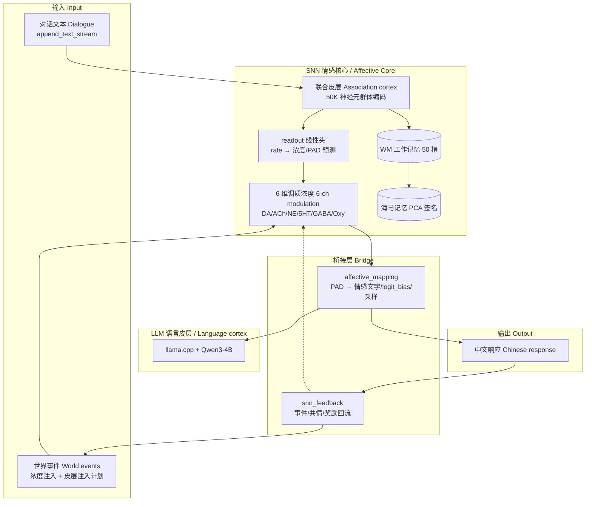

# VITA（维塔）— 人工情感核心 / VITA — Artificial Affective Core


> **SNN × LLM 异构认知架构**：SNN 作为**人工情感核心**（情感动力学 · 记忆检索 · 意图决策 · 调度器官），LLM 作为**语言皮层**（语言理解与表达）。
> **Heterogeneous cognitive architecture**: the SNN acts as the **artificial affective core** (affective dynamics · memory retrieval · intent decision · scheduling), while the LLM acts as the **language cortex** (language understanding and expression).
>
> 边缘可部署 · 中文原生 · 在线持续学习 · 无云端依赖 / Edge-deployable · Native Chinese · Online continual learning · No cloud dependency

---

## 项目定位 / Positioning

VITA 不是又一个 Transformer 大模型，也不是纯 SNN 研究项目。它是一台把"感受"与"表达"分开的**情感机器**：情感必须发生在 SNN 内部（神经元发放的动力学），语言表达交给 LLM。让 SNN 做它不可替代的事——**感受**（事件→情感动力学）、**记忆**（工作记忆/海马编码）、**决策**（意图 readout）与**调度**（调制 LLM 生成）。

VITA is not just another Transformer LLM, nor a pure SNN research project. It is an **affective machine** that separates *feeling* from *expression*: affect must emerge inside the SNN (spike-rate dynamics), while language expression is delegated to the LLM. The SNN does what it alone can — **feeling** (events → affective dynamics), **memory** (working memory / hippocampal encoding), **decision** (intent readout), and **scheduling** (modulating LLM generation).

| 子系统 / Subsystem | 职责 / Role | 实现 / Implementation |
|---|---|---|
| **SNN 情感核心** / Affective core | 情感动力学（6 维调质）、记忆（WM/海马）、意图、调度 / Affective dynamics (6-channel modulation), memory (WM/hippocampus), intent, scheduling | 自研 CUDA SNN：联合皮层 50K + 前额叶 5K + 运动皮层（60K 神经元 / 10.7M 突触 / 31 种生物机制） |
| **LLM 语言皮层** / Language cortex | 语言理解与生成、世界知识 / Language understanding, generation, world knowledge | llama.cpp + **Qwen3-4B**（INT4 GGUF，2.5GB，当前默认）；此前曾用 **MiniCPM5-1B**（历史模型，已弃用） |
| **Bridge 桥接层** / Bridge | 情感→调制信号（文字通道 + logit_bias + 采样参数）、对话→SNN 输入 / Affect → modulation signals; dialogue → SNN input | affective_mapping / emotion_bridge / snn_feedback |

**当前核心工程事实**（2026-08-06 深夜）：readout 根因已修复——事件直通联合皮层注入通道（事件→固定子区域，与文本流并行）已交付，事件信号进入网络内部（事件子区域 ratio>2，nz 全激活）。110K 训练 + 120 样本 eval 判据达标：mod MSE 0.0383（历史最优，90K 0.184 ↓79%）。生物拟真模块 M1-M4（杏仁核/HPA 皮质醇/脑岛/VTA-DA）已交付，详见 [docs/bio-plausible-modules-spec.md](docs/bio-plausible-modules-spec.md)。

**Current engineering fact** (2026-08-06 late): the readout root cause is fixed — the direct event→association-cortex injection channel (events activate fixed sub-regions, parallel to the text stream) is delivered; event signals now enter the network (event sub-region ratio>2, fully activated). 110K training + 120-sample eval pass both criteria: mod MSE 0.0383 (best ever; −79% vs the 0.184 at 90K). Bio-plausible modules M1–M4 (amygdala / HPA cortisol / insula / VTA-DA) are delivered — see [docs/bio-plausible-modules-spec.md](docs/bio-plausible-modules-spec.md).

---

## 系统架构 / Architecture



### 数据流 / Data Flow

1. **对话输入**：用户对话文本经 `append_text_stream` 追加进文本流 → 群体编码注入感觉神经元（SNN"看见"对话字节）。
   **Dialogue input**: user text is appended to the text stream → population-coded injection into sensory neurons (the SNN "sees" dialogue bytes).
2. **事件注入**：世界事件 → 6 维调质浓度（浓度模拟器同源公式）→ 决定 STDP 三因子与监督目标；事件直通皮层注入为下一步计划。
   **Event injection**: world events → 6-channel modulation concentrations (same formula as the concentration simulator) → drives STDP three-factor learning and supervision targets; direct cortical injection is the next planned step.
3. **情感读出**：`get_affective_state` 读 6 维浓度 → PAD 情感模型（Pleasure/Arousal/Dominance）→ LLM 调制信号。
   **Affective readout**: 6-channel concentrations → PAD model → LLM modulation signals.
4. **LLM 生成**：情感文字（system）+ logit_bias（逐 token 干预采样）+ 采样参数调制 → llama.cpp 生成响应。
   **LLM generation**: affective text (system prompt) + logit_bias (token-level sampling intervention) + sampler modulation → response.
5. **记忆**：WM/海马以 PCA 签名编码网络状态，host 侧解码字节指纹注入 system（记忆内容回显）。
   **Memory**: WM/hippocampus encode network state as PCA signatures; host-side decoding injects byte fingerprints into the system prompt.
6. **回流**：对话/反馈 → `emit_event`/`emit_empathy`/`emit_embodied_reward` → 浓度与 STDP。
   **Feedback loop**: dialogue/feedback → event/empathy/reward emission → concentrations and STDP.

---

## 当前状态 / Current Status（2026-08-06 深夜）

| 项 / Item | 状态 / Status | 说明 / Notes |
|---|---|---|
| 异构引擎闭环 / Engine loop | ✅ | resume → SNN 推进 → Affective 读出 → 情感调制 → llama.cpp 生成（Qwen3-4B，思考模式保留） |
| OpenAI 兼容 serve / Serve mode | ✅ | `GET /v1/models` + `POST /v1/chat/completions`，Bearer 鉴权，SNN 每请求推进，情感跨请求演化；`POST /v1/world` 世界事件注入 |
| SNN 记忆接入 / SNN memory | ✅ 一期 | WM/海马 PCA 签名 + host 解码字节指纹注入 system |
| logit_bias 通道 / Logit-bias channel | ✅ | SNN 逐 token 干预 LLM 采样分布 |
| 事件→皮层注入 / Event→cortex channel | ✅ | 事件直通联合皮层固定子区域（11×4545），ratio>2，事件信号进入网络内部 |
| 生物拟真模块 / Bio modules M1-M4 | ✅ | 杏仁核情感学习 / HPA 皮质醇慢轴 / 脑岛内感受 / VTA-DA 奖赏环路（见 spec 文档） |
| **110K 训练 + eval 判据** / 110K training & eval | ✅ | mod MSE 0.0383（历史最优）；事件可辨性多数类型 ratio>2；decode acc 38.8% |
| 情绪涌现诊断 / Emergence diagnostics | ✅ 已诊断 | `--eval-emergent` 120 样本：L1 事件扩散 4/9 类 ratio>2（social_bond 3.35 / question 3.88）；L2 readout 权重均匀（CV=0.008）；L3 Fisher=0.383（皮层模式尚未涌现情绪编码） |

**判别实验**（2026-08-07）：证明 SNN 对 LLM 的干预是真实质变而非 LLM"表演情绪"。两组对照**完全关闭文字通道**（`--ablate-prompt` 冻结情感 prompt 为中性），仅用 `--emotion-force` 把情绪给到满（`sad` / `happy`），同一中性输入 + 长文输出。即便模型看不到任何情绪文字，饱和悲伤把温度推到 1.00、饱和快乐保持 0.80，输出风格呈现可观测差异（悲伤克制审慎 / 快乐生动饱满）——干预由 SNN 数值通道真实承载。详见 [docs/emotion-discrimination-experiment-2026-08-07.md](docs/emotion-discrimination-experiment-2026-08-07.md)。
**Discrimination experiment** (2026-08-07): proves the SNN's influence on the LLM is a real qualitative change, not the LLM "acting affect". Two controlled runs fully froze the text channel (`--ablate-prompt`), drove affect to saturation via `--emotion-force` (`sad`/`happy`), and used the same neutral input with long outputs. Even with no affective text visible to the model, saturated sadness pushed temperature to 1.00 vs 0.80 for happiness, producing observable stylistic differences (sad = restrained/cautious; happy = vivid/positive) — the intervention is genuinely carried by the SNN's numeric channel. See [docs/emotion-discrimination-experiment-2026-08-07.md](docs/emotion-discrimination-experiment-2026-08-07.md).

**当前训练配置**：N3F 在线学习 + `--curriculum-continuous` + `--bptt-window-size 400` + `--embodied hunger_feeding`，checkpoint：`checkpoints/middle_1a_longarc_all/ckpt_step110000.snn2e`。浓度饱和已修复（AMYGDALA_DA/NE_MOD 0.25→0.08、EVENT_CORTEX_GAIN 12→6）。

**Current training config**: N3F online learning + `--curriculum-continuous` + `--bptt-window-size 400` + `--embodied hunger_feeding`; checkpoint: `checkpoints/middle_1a_longarc_all/ckpt_step110000.snn2e`. Concentration saturation fixed (AMYGDALA_DA/NE_MOD 0.25→0.08, EVENT_CORTEX_GAIN 12→6).

---

## 快速开始 / Quick Start

### 1. 环境要求 / Requirements

| 组件 / Component | 版本 / Version | 用途 / Purpose |
|---|---|---|
| CUDA Toolkit | 13.x | SNN 子系统 / SNN subsystem |
| CMake | ≥ 3.18 | 构建 / Build |
| Python | 3.10+ | 数据生成与评测 / Data generation & evaluation |
| llama.cpp | 最新 / latest | LLM 推理 / LLM inference |

硬件：NVIDIA GPU（compute capability ≥ 8.6，6GB+ 显存）；模型文件置于 `F:\hb_models\`（如 `Qwen3-4B-Q4_K_M.gguf`）。
Hardware: NVIDIA GPU (CC ≥ 8.6, 6GB+ VRAM); model files in `F:\hb_models\` (e.g. `Qwen3-4B-Q4_K_M.gguf`).

### 2. 构建 / Build

> Windows 需先设置 MSVC 环境变量（VS DevShell）；`cmd /c` 被安全策略禁止，用 PowerShell。

```powershell
# SNN 训练子系统（snn_train）
cmake --build build/snn --target snn_train

# 异构引擎（vita_engine，CUDA 源需 -Xcompiler=/utf-8）
# 构建脚本：scripts/hb_build_cli.ps1
```

### 3. 训练 / Training

```powershell
# 续跑训练（90K→110K 同款，含事件注入 + 具身脑岛）
snn_train --resume checkpoints/middle_1a_longarc_all/ckpt_step110000.snn2e --steps 120000 `
    --curriculum data/events/curriculum_all.jsonl --curriculum-stage 1 --curriculum-continuous `
    --bptt-window-size 400 --learning-rule n3f --curriculum-lr 0.0100 `
    --embodied --embodied-scene hunger_feeding --input-mode byte `
    --text data/scripts/story_text_all.txt --seed 42

# 评估（120 样本，窗口必须 400，训练用 continuous 则 eval 必须同带）
snn_train --resume checkpoints/middle_1a_longarc_all/ckpt_step110000.snn2e --steps 111200 `
    --curriculum-eval --curriculum-eval-samples 120 --curriculum data/events/curriculum_all.jsonl `
    --curriculum-stage 1 --curriculum-continuous --bptt-window-size 400 --input-mode byte `
    --text data/scripts/story_text_all.txt --seed 42

# 情绪涌现诊断（--eval-emergent: L1 事件扩散 / L2 readout 权重 / L3 模式效价区分度）
# 上条命令加 --eval-emergent 即可
```

### 4. 一键启动（推荐）/ One-Click Launcher

直接双击或在 PowerShell/CMD 中运行：

```batch
start_vita.bat
```

脚本会检查引擎、checkpoint、模型和语料文件，然后启动引擎：播放 4 阶段 VITA 苏醒动画 → 选择运行模式（1=对话模式，2=HTTP 服务）→ 进入交互。

`start_vita.bat` 顶部可配置：

```batch
set "ENGINE=build\root\bin\vita_engine.exe"
set "CHECKPOINT=checkpoints\middle_1a_longarc_all\ckpt_step110000.snn2e"
set "MODEL=F:\hb_models\Qwen3-4B-Q4_K_M.gguf"
set "TEXT=data\scripts\story_text_all.txt"
```

> **为什么需要 `--text`？** checkpoint 保存了训练语料的指纹，resume 时必须加载同一语料，否则 SNN 内部状态与文本流位置不一致。该文本作为 SNN 持续运行的"燃料"，被编码为神经元群体输入。

### 5. 对话引擎 / Dialogue Engine

```powershell
vita_engine.exe --resume checkpoints/middle_1a_longarc_all/ckpt_step110000.snn2e `
    --llm F:\hb_models\Qwen3-4B-Q4_K_M.gguf `
    --mod-interval 10 --steps-per-turn 10 --memory-budget-mb 4096
```

### 6. OpenAI 兼容 serve / OpenAI-Compatible Serve

```powershell
vita_engine.exe --serve --port 8899 --api-key <key> --model-name thetrueai `
    --resume checkpoints/<ckpt>.snn2e --llm F:\hb_models\Qwen3-4B-Q4_K_M.gguf
```

客户端配置：API 主机 `http://127.0.0.1:8899/v1`，API Key 与模型名默认 `thetrueai`。SNN 每请求推进 10 步，情感状态跨请求持续演化。
Client: base URL `http://127.0.0.1:8899/v1`; default API key and model name `thetrueai`. The SNN advances 10 steps per request; affect evolves across requests.

---

## 目录结构 / Directory Layout

```
vita/
├── src/
│   ├── snn/                # SNN 子系统（C++/CUDA）
│   │   ├── scheduler.cu    # 生物机制调度器（31 种机制）
│   │   ├── modulatory_kernels.cu    # 6 维调质 + AffectiveState readout
│   │   ├── mod_simulator.h          # 课程浓度模拟器（监督目标）
│   │   ├── input_encoding.cu        # 文本流群体编码注入
│   │   ├── bptt_curriculum.cu       # readout 监督头（调质/PAD/工具）
│   │   ├── wm_kernels.cu / hippocampal_kernels.cu  # 记忆
│   │   ├── event_types.h / gene_event_map.h        # 事件→调质映射
│   │   └── tools/         # 课程数据生成/长线剧本工具（Python）
│   ├── bridge/            # 桥接层：affective_mapping / emotion_bridge / snn_feedback
│   ├── vita/              # 引擎：engine / http_server / mini_json
│   └── llm/               # llama_backend（llama.cpp 封装）
├── data/
│   ├── events/            # 课程事件样本（curriculum_all.jsonl 204 段）
│   └── scripts/           # 长线叙事文本（story_text_all.txt）
├── curriculum_generator/  # 场景链生成器（Python）
├── docs/                  # 设计/训练计划/bug 清单
├── legacy/                # 上一代 SNN 研究代码（只读归档）
└── checkpoints/           # 训练检查点（git-ignore）
```

---

## 路线图 / Roadmap

- [x] **事件→联合皮层注入通道**（✅ 已交付）：事件直通联合皮层固定子区域，readout 有可学信号，SNN 内部涌现情感编码
  **Event→association-cortex injection channel** (✅ delivered): direct event input to fixed cortical sub-regions so the readout has learnable signal and affect emerges inside the network.
- [x] **情绪涌现诊断与验证**（✅ 已诊断）：`--eval-emergent` 三级证据——事件信息扩散 / readout 权重分布 / 皮层模式效价区分度。结论：事件信号已进网络（L1 部分类型 ratio>2），readout 为分布式均匀权重（L2 CV=0.008），皮层模式情绪区分度未涌现（L3 Fisher=0.383）——readout 靠全局发放水平拟合浓度，情绪编码尚未长进皮层模式
  **Emotion-emergence diagnostics** (✅ done): three-level evidence — event-info spread / readout weight distribution / cortical pattern valence discriminability. Conclusion: event signals do enter the network (L1 ratio>2 for several types), the readout uses distributed uniform weights (L2 CV=0.008), and cortical valence discriminability has not emerged (L3 Fisher=0.383) — the readout fits concentrations from global firing levels, valence coding has not yet grown into cortical patterns.
- [ ] **浓度→发放即时调制**：调质浓度直接改变神经元兴奋性（神经调质生理角色），情感存在于网络内部
  **Concentration→firing modulation**: neuromodulators directly alter neuron excitability — affect lives inside the network.
- [ ] **双输入接口**：`inject_world`（LLM 理解转化器→事件→皮层）+ `inject_dialogue`（对话→神经签名）
  **Dual input interfaces**: `inject_world` (LLM comprehension translator → events → cortex) + `inject_dialogue` (dialogue → neural signatures).
- [ ] **意图决策闭环**：恢复工具 readout 训练，SNN 决策 → 沙盒执行 → 事件反馈 → 因果学习
  **Intent-decision loop**: restore tool-readout training; SNN decides → sandbox executes → events feed back → causal learning.
- [ ] **评估口径对齐**：判据从"MSE 稳态拟合"改为"事件→情感响应方向/时程/恢复"
  **Evaluation alignment**: criterion shifts from "steady-state MSE fitting" to "event → affective response direction/time-course/recovery".

---

## 关键设计决策 / Key Design Decisions

### 为什么 LLM 不微调？/ Why not fine-tune the LLM?
个性化与持续学习全部交给 SNN（在线 STDP/三因子），LLM 保持冻结、跨用户复用。情感调制走 prompt（文字）+ logit_bias（采样）双通道，不改权重。
All personalization and continual learning live in the SNN (online STDP/three-factor); the LLM stays frozen and reusable across users. Affect modulates via prompt text + logit_bias (sampling), never touching weights.

### 为什么 SNN 是核心而非附庸？/ Why is the SNN the core, not an accessory?
情感不能由"浓度模拟器"外部算好后塞进 prompt——那样会退化成普通角色扮演 LLM。VITA 的方向是让**事件直接塑造 SNN 发放**，情感作为网络内部自发的动力学状态涌现，LLM 只负责"读懂并表达"。当前 readout 根因（事件未进网络）正是这条路上的第一个硬骨头。
Affect must not be computed externally by a "concentration simulator" and stuffed into the prompt — that degenerates into ordinary role-play. VITA's direction is to let **events directly shape SNN firing**, so affect emerges as intrinsic network dynamics, with the LLM only "reading and expressing". The confirmed readout root cause (events never enter the network) is exactly the first hard problem on this path.

### 为什么保留 legacy/？/ Why keep legacy/?
`legacy/stage2e/` 的 BPTT trainer、PCA 签名、丘脑门控等模块经过 10K-100K 步训练验证，是可复用参考。
`legacy/stage2e/` (BPTT trainer, PCA signatures, thalamic gating) was validated over 10K–100K training steps and remains a reusable reference.

---

## 社区 / Community

- **API 文档**：[docs/API.md](docs/API.md) — `/v1/models`、`/v1/chat/completions`、`/v1/world` 契约
- **快速上手**：[docs/QUICKSTART.md](docs/QUICKSTART.md) — 从构建到 serve 的完整步骤与踩坑
- **贡献指南**：[CONTRIBUTING.md](CONTRIBUTING.md) — Issue/PR 流程、代码风格、提交规范
- **行为准则**：[CODE_OF_CONDUCT.md](CODE_OF_CONDUCT.md) — 社区行为规范

---

## 许可 / License

CC-BY-4.0 — 见 [LICENSE](./LICENSE)（仅需署名即可）。`legacy/` 旧代码继承自上一代项目（原 CC BY 4.0），统一采用 CC-BY-4.0。
CC-BY-4.0 — see [LICENSE](./LICENSE) (attribution only). `legacy/` code inherits from the previous project (originally CC BY 4.0); the whole project uses CC-BY-4.0.

## 致谢 / Acknowledgements

- **Qwen3-4B**：阿里巴巴通义团队，Qwen 开源系列 / Alibaba Qwen team, open Qwen series
- **MiniCPM5-1B**：面壁智能 + 清华 + OpenBMB（历史默认模型，已弃用）/ ModelBest + Tsinghua + OpenBMB (former default, deprecated)
- **llama.cpp**：Georgi Gerganov，C++ LLM 推理事实标准 / the de-facto C++ LLM inference standard
- **LCCC-base 语料**：清华大学 + 三星 / Tsinghua University + Samsung
- **CUDA Toolkit**：NVIDIA
